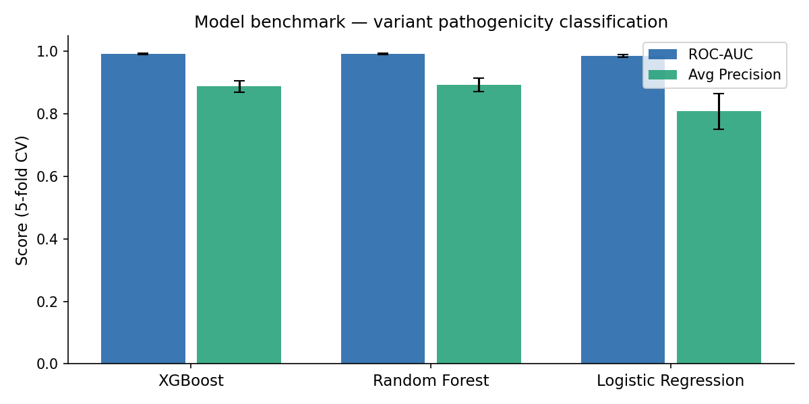
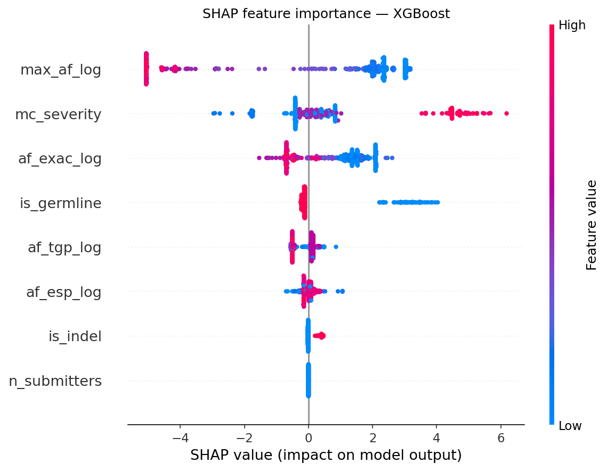

# Variant Pathogenicity Prioritization Pipeline

An end-to-end Snakemake pipeline that ingests raw VCF files, engineers biologically
meaningful features from ClinVar annotations, and trains an XGBoost classifier to
predict variant pathogenicity — benchmarked against ClinVar ground truth.

**Disease focus:** Alzheimer's disease / Parkinson's disease variants (chr22)

## Results





| Model | ROC-AUC (5-fold CV) | Avg Precision |
|---|---|---|
| XGBoost | **0.992 ± 0.001** | 0.888 ± 0.018 |
| Random Forest | 0.991 ± 0.002 | 0.892 ± 0.021 |
| Logistic Regression | 0.985 ± 0.005 | 0.808 ± 0.057 |

Top SHAP features: `max_af_log`, `mc_severity`, `af_exac_log`


## Features used

| Feature | Description |
|---|---|
| `mc_severity` | Molecular consequence severity (stop-gain=8, missense=4, synonymous=1) |
| `max_af_log` | log10(max population allele frequency) across ESP, ExAC, 1000G |
| `af_esp_log` | log10(ESP allele frequency + 1e-8) |
| `af_exac_log` | log10(ExAC allele frequency + 1e-8) |
| `af_tgp_log` | log10(1000 Genomes allele frequency + 1e-8) |
| `is_indel` | Whether variant is an insertion/deletion |
| `is_germline` | Whether variant is of germline origin |
| `n_submitters` | Number of ClinVar submitters (proxy for evidence strength) |

## Quick start
```bash
# 1. clone repo
git clone https://github.com/Mithrasen/Variant-Prioritization-Pipeline---Snakemake
cd Variant-Prioritization-Pipeline---Snakemake

# 2. install Snakemake
mamba create -n snakemake -c conda-forge -c bioconda snakemake=8 -y
conda activate snakemake

# 3. download ClinVar data
mkdir -p resources/vcf && cd resources/vcf
wget https://ftp.ncbi.nlm.nih.gov/pub/clinvar/vcf_GRCh38/clinvar.vcf.gz
wget https://ftp.ncbi.nlm.nih.gov/pub/clinvar/vcf_GRCh38/clinvar.vcf.gz.tbi

bcftools filter -i 'INFO/CLNSIG~"Pathogenic"' clinvar.vcf.gz -Oz -o clinvar_pathogenic_chr22.vcf.gz
bcftools filter -i 'INFO/CLNSIG~"Benign"' clinvar.vcf.gz -Oz -o clinvar_benign_chr22.vcf.gz
bcftools view clinvar_pathogenic_chr22.vcf.gz 22 -Oz -o clinvar_pathogenic_chr22.vcf.gz
bcftools view clinvar_benign_chr22.vcf.gz 22 -Oz -o clinvar_benign_chr22.vcf.gz
tabix -p vcf clinvar_pathogenic_chr22.vcf.gz
tabix -p vcf clinvar_benign_chr22.vcf.gz

# 4. dry run
cd ../..
snakemake --snakefile workflow/Snakefile -n --cores 4 --use-conda

# 5. run
snakemake --snakefile workflow/Snakefile --cores 4 --use-conda
```

## Data sources

- **ClinVar** — [ftp.ncbi.nlm.nih.gov/pub/clinvar](https://ftp.ncbi.nlm.nih.gov/pub/clinvar/vcf_GRCh38/)

## Limitations

The high ROC-AUC (0.992) reflects the relatively clean separation between
ClinVar Pathogenic and Benign labels. Performance on variants of uncertain
significance (VUS) in the real clinical setting would be lower, this is a
known limitation of ClinVar-trained models due to ascertainment bias toward
well-studied disease genes.